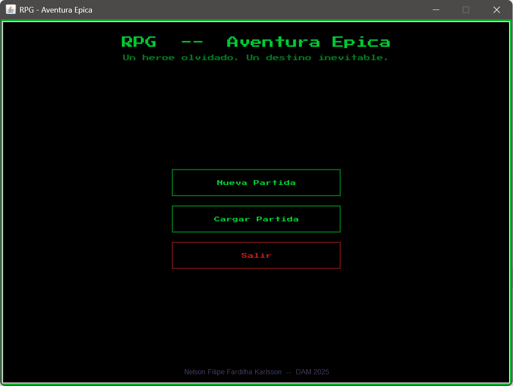
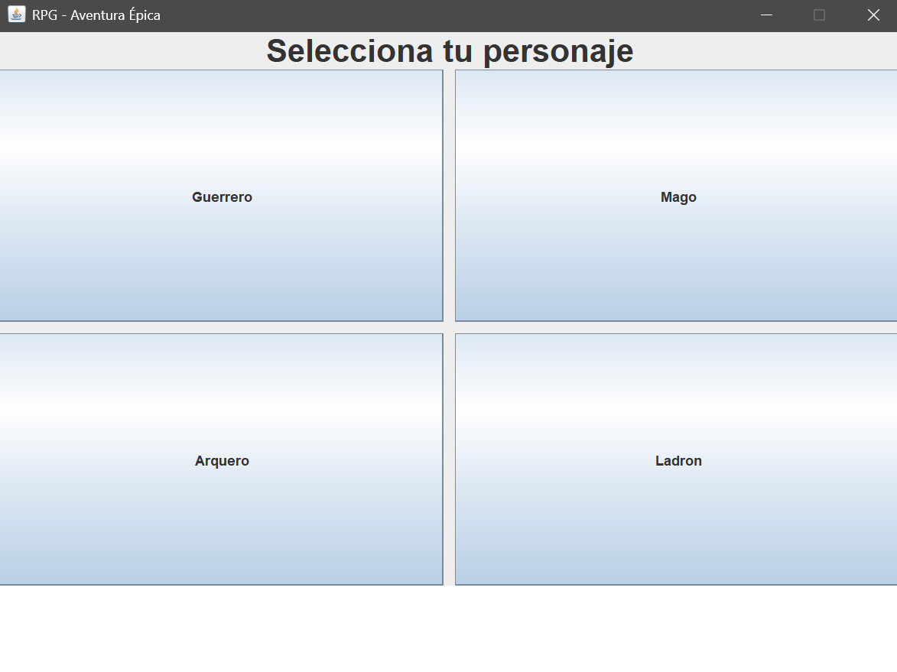
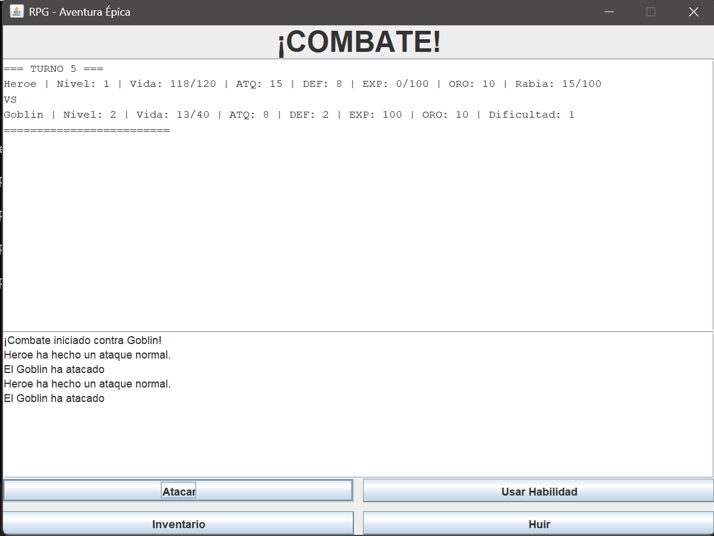
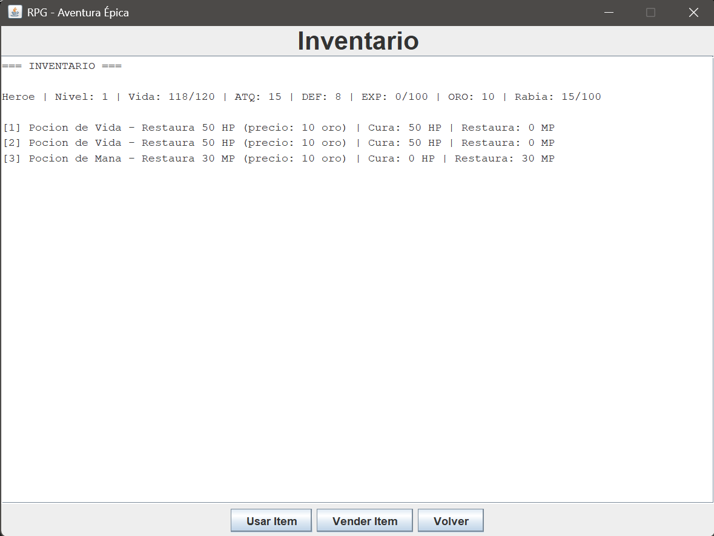

#  RPG - Aventura Épica

RPG por turnos desarrollado en Java con interfaz gráfica Swing. Proyecto educativo que demuestra conocimientos en programación orientada a objetos, estructuras de datos, persistencia y desarrollo de interfaces.

---

## 📸 Capturas de Pantalla

### Menú Principal


### Selección de Personaje


### Sistema de Combate


### Inventario


---

##  Características

###  Sistema de Personajes
- **4 clases jugables**: Guerrero, Mago, Arquero, Ladrón
- Cada clase con mecánicas únicas (rabia, maná, precisión, esquiva)
- Sistema de experiencia y subida de nivel
- 2 habilidades especiales por clase

###  Sistema de Combate
- Combate por turnos estratégico
- 4 tipos de enemigos con mecánicas diferenciadas
- Generación procedural de enemigos según nivel
- Boss final con sistema de fases

###  Inventario y Items
- Sistema de inventario con capacidad limitada (20 slots)
- 3 tipos de items: Armas, Armaduras, Consumibles
- Sistema de drops aleatorios tras combates
- Compra/venta de items

###  Narrativa Ramificada
- 12 nodos narrativos interconectados
- Múltiples caminos y decisiones
- 2 finales diferentes (victoria/huida)
- Exploración no lineal

###  Sistema de Guardado
- Guardado y carga de partidas mediante serialización
- Persistencia del progreso del jugador
- Fecha y hora de guardado

###  Interfaz Gráfica
- 6 pantallas diferentes con Swing
- Navegación fluida entre pantallas
- Mensajes dinámicos según oro acumulado

---

##  Tecnologías Utilizadas

- **Lenguaje**: Java 21 LTS
- **GUI**: Java Swing
- **Persistencia**: Serialización (Java I/O)
- **IDE**: NetBeans
- **Control de versiones**: Git & GitHub

---

##  Estructura del Proyecto
```
src/juegorpg/
├── JuegoRPG.java (Main)
├── combate/
│   └── SistemaCombate.java
├── guardado/
│   ├── GestorGuardado.java
│   └── PartidaGuardada.java
├── modelo/
│   ├── Entidad.java
│   ├── enemigo/
│   │   ├── Enemigo.java
│   │   ├── Goblin.java
│   │   ├── Orco.java
│   │   ├── Dragon.java
│   │   └── BossFinal.java
│   ├── habilidad/
│   │   ├── Habilidad.java
│   │   ├── HabilidadFisica.java
│   │   └── HabilidadMagica.java
│   ├── item/
│   │   ├── Item.java
│   │   ├── Arma.java
│   │   ├── Armadura.java
│   │   ├── Consumible.java
│   │   └── Inventario.java
│   └── personaje/
│       ├── Personaje.java
│       ├── Guerrero.java
│       ├── Mago.java
│       ├── Arquero.java
│       └── Ladron.java
├── narrativa/
│   ├── ArbolNarrativo.java
│   ├── Nodo.java
│   └── Opcion.java
├── rng/
│   └── GeneradorRNG.java
└── vista/
    ├── VentanaPrincipal.java
    ├── PantallaMenu.java
    ├── PantallaSeleccionPersonaje.java
    ├── PantallaExploracion.java
    ├── PantallaCombate.java
    ├── PantallaInventario.java
    └── PantallaGameOver.java
```

---

##  Cómo Ejecutar

### Opción 1: Ejecutar desde NetBeans
1. Clona el repositorio:
```bash
   git clone https://github.com/NUXX-G/JuegoRPG.git
```
2. Abre el proyecto en NetBeans
3. Ejecuta `JuegoRPG.java`

### Opción 2: Ejecutar el archivo JAR
1. Descarga `JuegoRPG.jar` desde [Releases](https://github.com/NUXX-G/JuegoRPG/releases)
2. Ejecuta desde terminal:
```bash
   java -jar JuegoRPG.jar
```
3. O haz doble clic en el archivo (requiere Java 21+ instalado)

---

##  Conceptos de Programación Implementados

### Programación Orientada a Objetos
- ✅ Herencia (Entidad → Personaje → Guerrero/Mago/Arquero/Ladrón)
- ✅ Polimorfismo (calcularDanioAtaque() diferente en cada clase)
- ✅ Clases abstractas (Entidad, Personaje, Enemigo, Habilidad, Item)
- ✅ Encapsulación (atributos private, getters/setters)
- ✅ Composición (Personaje HAS-A Inventario, HAS-A Habilidades)

### Estructuras de Datos
- ✅ ArrayList para colecciones dinámicas
- ✅ Árbol de decisiones (narrativa ramificada)

### Patrones de Diseño
- ✅ Strategy (diferentes algoritmos de daño por clase)
- ✅ Template Method (alSubirNivel() en cada personaje)

### Persistencia
- ✅ Serialización de objetos
- ✅ Manejo de archivos (I/O)

---

##  Roadmap Futuro

### Versión 2.0 - Web (En desarrollo)
- [ ] Backend con **Spring Boot**
- [ ] API REST para sistema de combate
- [ ] Base de datos con **JPA/Hibernate** (MySQL/PostgreSQL)
- [ ] Sistema de autenticación (**Spring Security**)
- [ ] Frontend web (HTML/CSS/JavaScript + Fetch API)
- [ ] Despliegue en VPS personal

### Funcionalidades Adicionales
- [ ] Sistema de equipamiento funcional
- [ ] Más clases de personajes
- [ ] Misiones secundarias
- [ ] Tienda de items
- [ ] Multijugador (PvP)

---

##  Autor

**Nelson Filipe Fardilha Karlsson**

---
